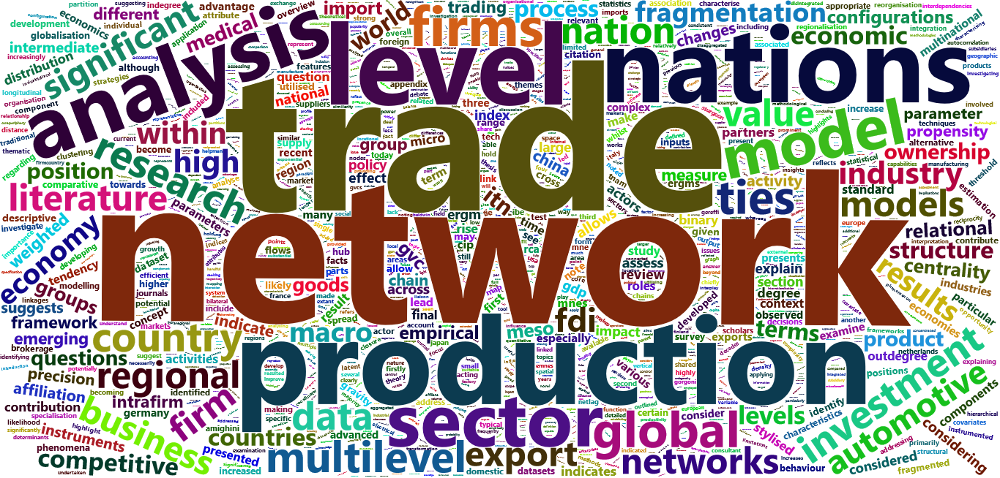

# PhD Thesis
I completed my PhD in international business and economics at the University of Greenwich in 2016, where I made use of advanced social network analysis techniques to inform on features of the global economy.

My thesis consisted of three papers/essays addressing the globalisation of industries in recent decades, with a focus on the fragmentation of production.

The first provides the case for a network approach to analyse various aspects of the global economy, more specifically:

1. International Trade
2. Foreign Direct Investment (FDI)
3. Multinational Enterprise (MNE) Activity
4. Fragmentation of Production
5. Globalisation Vs Regionalisation Debate

The second paper presented a multilevel network analysis to examine trade and investment patterns in a high tech sector.  

The third paper provided an analysis of the interplay between the international trade network and national competitiveness in the automotive sector. More specifically examining how a nation’s position in an international network of trade and efficient linkages to competitive nations impacts a nation’s competitive performance.  

My thesis can be found at:
[THESIS_CORPORATE NETWORKS OF INTERNATIONAL INVESTMENT & TRADE](https://www.researchgate.net/publication/319876899_Corporate_networks_of_international_investment_and_trade)

Here is a wordcloud based on my thesis:

